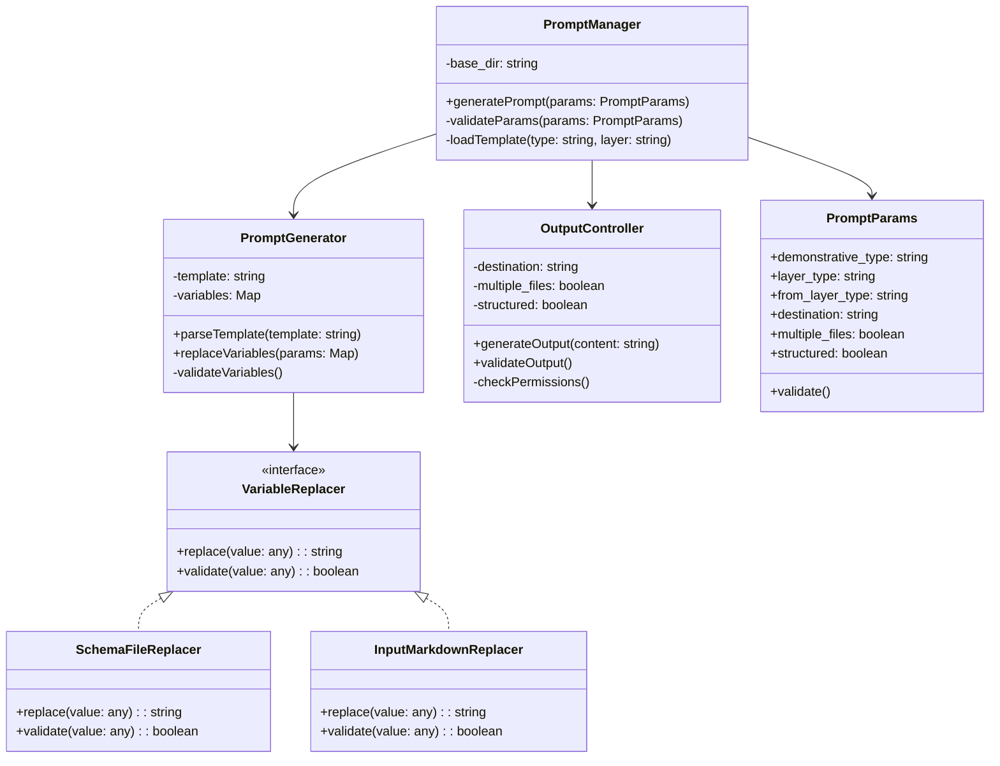

```mermaid
classDiagram
    class PromptManager {
        -base_dir: string
        +generatePrompt(params: PromptParams)
        -validateParams(params: PromptParams)
        -loadTemplate(type: string, layer: string)
    }

    class PromptGenerator {
        -template: string
        -variables: Map
        +parseTemplate(template: string)
        +replaceVariables(params: Map)
        -validateVariables()
    }

    class VariableReplacer {
        <<interface>>
        +replace(value: any): string
        +validate(value: any): boolean
    }

    class SchemaFileReplacer {
        +replace(value: any): string
        +validate(value: any): boolean
    }

    class InputMarkdownReplacer {
        +replace(value: any): string
        +validate(value: any): boolean
    }

    class OutputController {
        -destination: string
        -multiple_files: boolean
        -structured: boolean
        +generateOutput(content: string)
        +validateOutput()
        -checkPermissions()
    }

    class PromptParams {
        +demonstrative_type: string
        +layer_type: string
        +from_layer_type: string
        +destination: string
        +multiple_files: boolean
        +structured: boolean
        +validate()
    }

    PromptManager --> PromptGenerator
    PromptManager --> OutputController
    PromptGenerator --> VariableReplacer
    VariableReplacer <|.. SchemaFileReplacer
    VariableReplacer <|.. InputMarkdownReplacer
    PromptManager --> PromptParams
```
