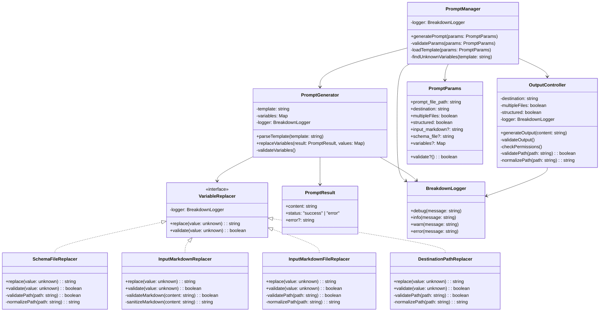

```mermaid
classDiagram
    class PromptManager {
        +generatePrompt(params: PromptParams)
        -validateParams(params: PromptParams)
        -loadTemplate(params: PromptParams)
        -findUnknownVariables(template: string)
        -logger: BreakdownLogger
    }

    class PromptGenerator {
        -template: string
        -variables: Map<string, VariableReplacer>
        +parseTemplate(template: string)
        +replaceVariables(result: PromptResult, values: Map)
        -validateVariables()
        -logger: BreakdownLogger
    }

    class VariableReplacer {
        <<interface>>
        +replace(value: unknown): string
        +validate(value: unknown): boolean
        -logger: BreakdownLogger
    }

    class SchemaFileReplacer {
        +replace(value: unknown): string
        +validate(value: unknown): boolean
        -validatePath(path: string): boolean
        -normalizePath(path: string): string
    }

    class InputMarkdownReplacer {
        +replace(value: unknown): string
        +validate(value: unknown): boolean
        -validateMarkdown(content: string): boolean
        -sanitizeMarkdown(content: string): string
    }

    class InputMarkdownFileReplacer {
        +replace(value: unknown): string
        +validate(value: unknown): boolean
        -validatePath(path: string): boolean
        -normalizePath(path: string): string
    }

    class DestinationPathReplacer {
        +replace(value: unknown): string
        +validate(value: unknown): boolean
        -validatePath(path: string): boolean
        -normalizePath(path: string): string
    }

    class OutputController {
        -destination: string
        -multipleFiles: boolean
        -structured: boolean
        +generateOutput(content: string)
        -validateOutput()
        -checkPermissions()
        -logger: BreakdownLogger
        -validatePath(path: string): boolean
        -normalizePath(path: string): string
    }

    class PromptParams {
        +prompt_file_path: string
        +destination: string
        +multipleFiles: boolean
        +structured: boolean
        +input_markdown?: string
        +schema_file?: string
        +validate?(): boolean
        +variables?: Map<string, unknown>
    }

    class PromptResult {
        +content: string
        +status: "success" | "error"
        +error?: string
    }

    class BreakdownLogger {
        +debug(message: string)
        +info(message: string)
        +warn(message: string)
        +error(message: string)
    }

    PromptManager --> PromptGenerator
    PromptManager --> OutputController
    PromptManager --> BreakdownLogger
    PromptGenerator --> VariableReplacer
    PromptGenerator --> BreakdownLogger
    VariableReplacer <|.. SchemaFileReplacer
    VariableReplacer <|.. InputMarkdownReplacer
    VariableReplacer <|.. InputMarkdownFileReplacer
    VariableReplacer <|.. DestinationPathReplacer
    PromptManager --> PromptParams
    PromptGenerator --> PromptResult
    OutputController --> BreakdownLogger
```
