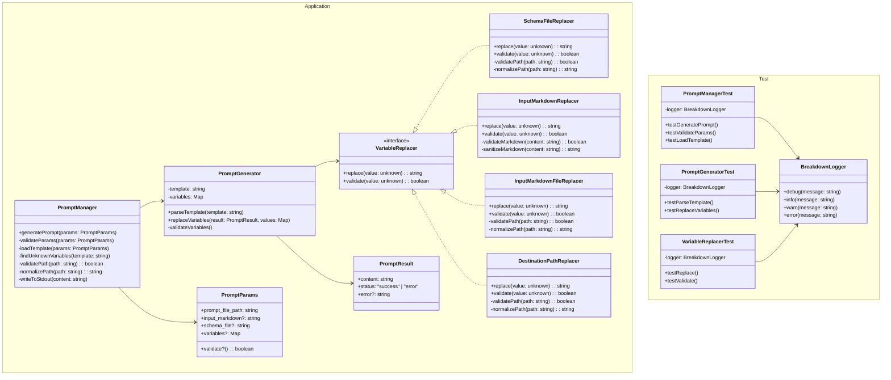

```mermaid
classDiagram
    namespace Application {
        class PromptManager {
            +generatePrompt(params: PromptParams)
            -validateParams(params: PromptParams)
            -loadTemplate(params: PromptParams)
            -findUnknownVariables(template: string)
            -validatePath(path: string): boolean
            -normalizePath(path: string): string
            -writeToStdout(content: string)
        }

        class PromptGenerator {
            -template: string
            -variables: Map<string, VariableReplacer>
            +parseTemplate(template: string)
            +replaceVariables(result: PromptResult, values: Map)
            -validateVariables()
        }

        class VariableReplacer {
            <<interface>>
            +replace(value: unknown): string
            +validate(value: unknown): boolean
        }

        class SchemaFileReplacer {
            +replace(value: unknown): string
            +validate(value: unknown): boolean
            -validatePath(path: string): boolean
            -normalizePath(path: string): string
        }

        class InputMarkdownReplacer {
            +replace(value: unknown): string
            +validate(value: unknown): boolean
            -validateMarkdown(content: string): boolean
            -sanitizeMarkdown(content: string): string
        }

        class InputMarkdownFileReplacer {
            +replace(value: unknown): string
            +validate(value: unknown): boolean
            -validatePath(path: string): boolean
            -normalizePath(path: string): string
        }

        class DestinationPathReplacer {
            +replace(value: unknown): string
            +validate(value: unknown): boolean
            -validatePath(path: string): boolean
            -normalizePath(path: string): string
        }

        class PromptParams {
            +prompt_file_path: string
            +input_markdown?: string
            +schema_file?: string
            +validate?(): boolean
            +variables?: Map<string, unknown>
        }

        class PromptResult {
            +content: string
            +status: "success" | "error"
            +error?: string
        }
    }

    namespace Test {
        class BreakdownLogger {
            +debug(message: string)
            +info(message: string)
            +warn(message: string)
            +error(message: string)
        }

        class PromptManagerTest {
            -logger: BreakdownLogger
            +testGeneratePrompt()
            +testValidateParams()
            +testLoadTemplate()
        }

        class PromptGeneratorTest {
            -logger: BreakdownLogger
            +testParseTemplate()
            +testReplaceVariables()
        }

        class VariableReplacerTest {
            -logger: BreakdownLogger
            +testReplace()
            +testValidate()
        }
    }

    PromptManager --> PromptGenerator
    PromptGenerator --> VariableReplacer
    VariableReplacer <|.. SchemaFileReplacer
    VariableReplacer <|.. InputMarkdownReplacer
    VariableReplacer <|.. InputMarkdownFileReplacer
    VariableReplacer <|.. DestinationPathReplacer
    PromptManager --> PromptParams
    PromptGenerator --> PromptResult

    PromptManagerTest --> BreakdownLogger
    PromptGeneratorTest --> BreakdownLogger
    VariableReplacerTest --> BreakdownLogger
```
