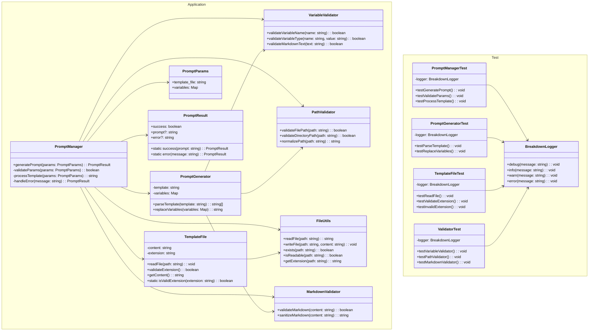

```mermaid
classDiagram
    namespace Application {
        class PromptManager {
            +generatePrompt(params: PromptParams): PromptResult
            -validateParams(params: PromptParams): boolean
            -processTemplate(params: PromptParams): string
            -handleError(message: string): PromptResult
        }

        class PromptGenerator {
            -template: string
            -variables: Map<string, string>
            +parseTemplate(template: string): string[]
            +replaceVariables(variables: Map<string, string>): string
        }

        class TemplateFile {
            -content: string
            -extension: string
            +readFile(path: string): void
            +validateExtension(): boolean
            +getContent(): string
            +static isValidExtension(extension: string): boolean
        }

        class VariableValidator {
            +validateVariableName(name: string): boolean
            +validateVariableType(name: string, value: string): boolean
            +validateMarkdownText(text: string): boolean
        }

        class PathValidator {
            +validateFilePath(path: string): boolean
            +validateDirectoryPath(path: string): boolean
            +normalizePath(path: string): string
        }

        class FileUtils {
            +readFile(path: string): string
            +writeFile(path: string, content: string): void
            +exists(path: string): boolean
            +isReadable(path: string): boolean
            +getExtension(path: string): string
        }

        class MarkdownValidator {
            +validateMarkdown(content: string): boolean
            +sanitizeMarkdown(content: string): string
        }

        class PromptParams {
            +template_file: string
            +variables: Map<string, string>
        }

        class PromptResult {
            +success: boolean
            +prompt?: string
            +error?: string
            +static success(prompt: string): PromptResult
            +static error(message: string): PromptResult
        }
    }

    namespace Test {
        class BreakdownLogger {
            +debug(message: string): void
            +info(message: string): void
            +warn(message: string): void
            +error(message: string): void
        }

        class PromptManagerTest {
            -logger: BreakdownLogger
            +testGeneratePrompt(): void
            +testValidateParams(): void
            +testProcessTemplate(): void
        }

        class PromptGeneratorTest {
            -logger: BreakdownLogger
            +testParseTemplate(): void
            +testReplaceVariables(): void
        }

        class TemplateFileTest {
            -logger: BreakdownLogger
            +testReadFile(): void
            +testValidateExtension(): void
            +testInvalidExtension(): void
        }

        class ValidatorTest {
            -logger: BreakdownLogger
            +testVariableValidator(): void
            +testPathValidator(): void
            +testMarkdownValidator(): void
        }
    }

    PromptManager --> PromptGenerator
    PromptManager --> TemplateFile
    PromptManager --> VariableValidator
    PromptManager --> PathValidator
    PromptManager --> FileUtils
    PromptManager --> MarkdownValidator
    PromptManager --> PromptParams
    PromptManager --> PromptResult

    PromptGenerator --> VariableValidator
    PromptGenerator --> PathValidator
    PromptGenerator --> MarkdownValidator

    TemplateFile --> FileUtils

    PromptManagerTest --> BreakdownLogger
    PromptGeneratorTest --> BreakdownLogger
    TemplateFileTest --> BreakdownLogger
    ValidatorTest --> BreakdownLogger
```
