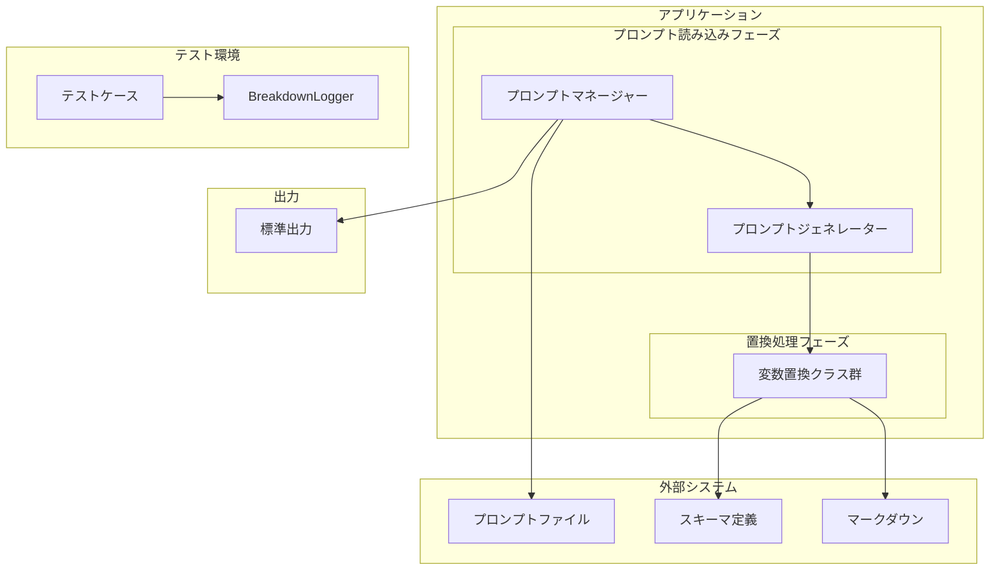

```mermaid
graph TB
    subgraph "アプリケーション"
        subgraph "プロンプト読み込みフェーズ"
            PM[プロンプトマネージャー]
            PG[プロンプトジェネレーター]
        end

        subgraph "置換処理フェーズ"
            VR[変数置換クラス群]
        end
    end

    subgraph "外部システム"
        PF[プロンプトファイル]
        SC[スキーマ定義]
        MD[マークダウン]
    end

    subgraph "出力"
        ST[標準出力]
    end

    PM --> PG
    PG --> VR
    PM --> PF
    VR --> SC
    VR --> MD
    PM --> ST

    subgraph "テスト環境"
        BL[BreakdownLogger]
        TST[テストケース]
    end

    TST --> BL
```
