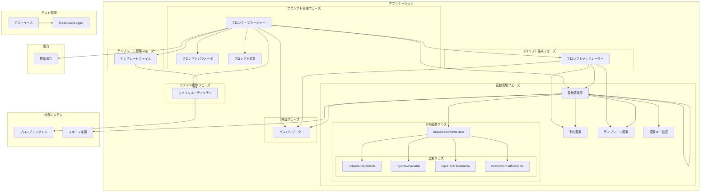

```mermaid
graph TB
    subgraph "アプリケーション"
        subgraph "プロンプト管理フェーズ"
            PM[プロンプトマネージャー]
            PP[プロンプトパラメータ]
            PR[プロンプト結果]
        end

        subgraph "プロンプト生成フェーズ"
            PG[プロンプトジェネレーター]
        end

        subgraph "テンプレート管理フェーズ"
            TF[テンプレートファイル]
        end

        subgraph "変数管理フェーズ"
            VV[変数バリデーター]
            RV[予約変数]
            TV[テンプレート変数]
            VK[変数キー検証]
            VV[変数値検証]
            subgraph "予約変数クラス"
                BRV[BaseReservedVariable]
                subgraph "具象クラス"
                    SF[SchemaFileVariable]
                    IT[InputTextVariable]
                    IF[InputTextFileVariable]
                    DP[DestinationPathVariable]
                end
            end
        end

        subgraph "検証フェーズ"
            PV[パスバリデーター]
        end

        subgraph "ファイル操作フェーズ"
            FU[ファイルユーティリティ]
        end
    end

    subgraph "外部システム"
        PF[プロンプトファイル]
        SC[スキーマ定義]
    end

    subgraph "出力"
        ST[標準出力]
    end

    PM --> PP
    PM --> PR
    PM --> PG
    PM --> TF
    PM --> VV
    PM --> PV
    PM --> FU

    PG --> VV
    PG --> PV
    PG --> RV
    PG --> TV

    TF --> FU
    FU --> PF
    VV --> SC
    VV --> RV
    VV --> TV
    VV --> PV
    VV --> VK
    VV --> VV
    VV --> BRV
    BRV --> SF
    BRV --> IT
    BRV --> IF
    BRV --> DP
    PM --> ST

    subgraph "テスト環境"
        BL[BreakdownLogger]
        TST[テストケース]
    end

    TST --> BL
```
