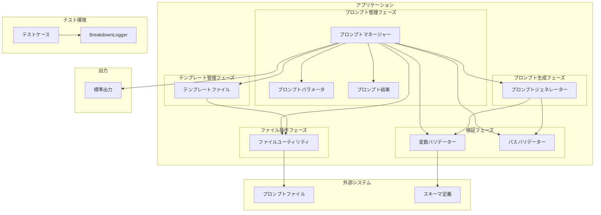

```mermaid
graph TB
    subgraph "アプリケーション"
        subgraph "プロンプト管理フェーズ"
            PM[プロンプトマネージャー]
            PP[プロンプトパラメータ]
            PR[プロンプト結果]
        end

        subgraph "プロンプト生成フェーズ"
            PG[プロンプトジェネレーター]
        end

        subgraph "テンプレート管理フェーズ"
            TF[テンプレートファイル]
        end

        subgraph "検証フェーズ"
            VV[変数バリデーター]
            PV[パスバリデーター]
        end

        subgraph "ファイル操作フェーズ"
            FU[ファイルユーティリティ]
        end
    end

    subgraph "外部システム"
        PF[プロンプトファイル]
        SC[スキーマ定義]
    end

    subgraph "出力"
        ST[標準出力]
    end

    PM --> PP
    PM --> PR
    PM --> PG
    PM --> TF
    PM --> VV
    PM --> PV
    PM --> FU

    PG --> VV
    PG --> PV

    TF --> FU
    FU --> PF
    VV --> SC
    PM --> ST

    subgraph "テスト環境"
        BL[BreakdownLogger]
        TST[テストケース]
    end

    TST --> BL
```
