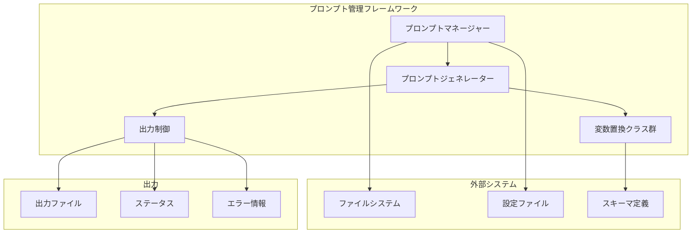

```mermaid
graph TB
    subgraph "プロンプト管理フレームワーク"
        PM[プロンプトマネージャー]
        PG[プロンプトジェネレーター]
        VR[変数置換クラス群]
        OC[出力制御]
    end

    subgraph "外部システム"
        FS[ファイルシステム]
        CF[設定ファイル]
        SC[スキーマ定義]
    end

    subgraph "出力"
        OP[出力ファイル]
        ST[ステータス]
        ER[エラー情報]
    end

    PM --> PG
    PG --> VR
    PG --> OC
    PM --> FS
    PM --> CF
    VR --> SC
    OC --> OP
    OC --> ST
    OC --> ER
```
