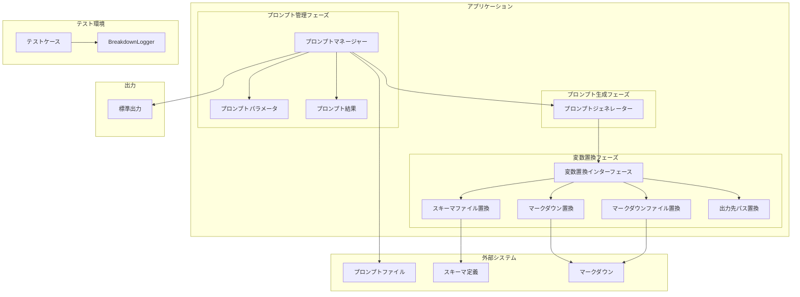

```mermaid
graph TB
    subgraph "アプリケーション"
        subgraph "プロンプト管理フェーズ"
            PM[プロンプトマネージャー]
            PP[プロンプトパラメータ]
            PR[プロンプト結果]
        end

        subgraph "プロンプト生成フェーズ"
            PG[プロンプトジェネレーター]
        end

        subgraph "変数置換フェーズ"
            VR[変数置換インターフェース]
            SF[スキーマファイル置換]
            IM[マークダウン置換]
            IMF[マークダウンファイル置換]
            DP[出力先パス置換]
        end
    end

    subgraph "外部システム"
        PF[プロンプトファイル]
        SC[スキーマ定義]
        MD[マークダウン]
    end

    subgraph "出力"
        ST[標準出力]
    end

    PM --> PP
    PM --> PR
    PM --> PG
    PG --> VR
    VR --> SF
    VR --> IM
    VR --> IMF
    VR --> DP
    PM --> PF
    SF --> SC
    IM --> MD
    IMF --> MD
    PM --> ST

    subgraph "テスト環境"
        BL[BreakdownLogger]
        TST[テストケース]
    end

    TST --> BL
```
