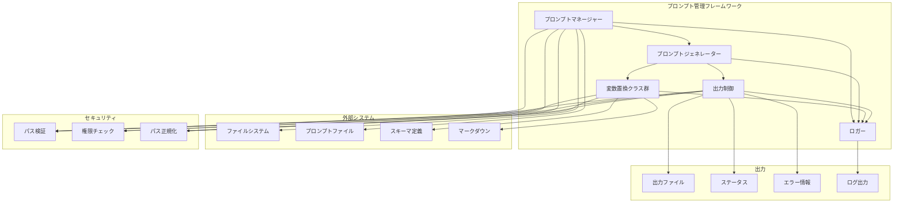

```mermaid
graph TB
    subgraph "プロンプト管理フレームワーク"
        PM[プロンプトマネージャー]
        PG[プロンプトジェネレーター]
        VR[変数置換クラス群]
        OC[出力制御]
        LG[ロガー]
    end

    subgraph "外部システム"
        FS[ファイルシステム]
        PF[プロンプトファイル]
        SC[スキーマ定義]
        MD[マークダウン]
    end

    subgraph "出力"
        OP[出力ファイル]
        ST[ステータス]
        ER[エラー情報]
        LOG[ログ出力]
    end

    subgraph "セキュリティ"
        PA[パス検証]
        PC[権限チェック]
        PS[パス正規化]
    end

    PM --> PG
    PG --> VR
    PG --> OC
    PM --> FS
    PM --> PF
    VR --> SC
    VR --> MD
    OC --> OP
    OC --> ST
    OC --> ER
    
    PM --> LG
    PG --> LG
    VR --> LG
    OC --> LG
    LG --> LOG
    
    PM --> PA
    PM --> PC
    PM --> PS
    OC --> PA
    OC --> PC
    OC --> PS
    VR --> PA
    VR --> PS
```
