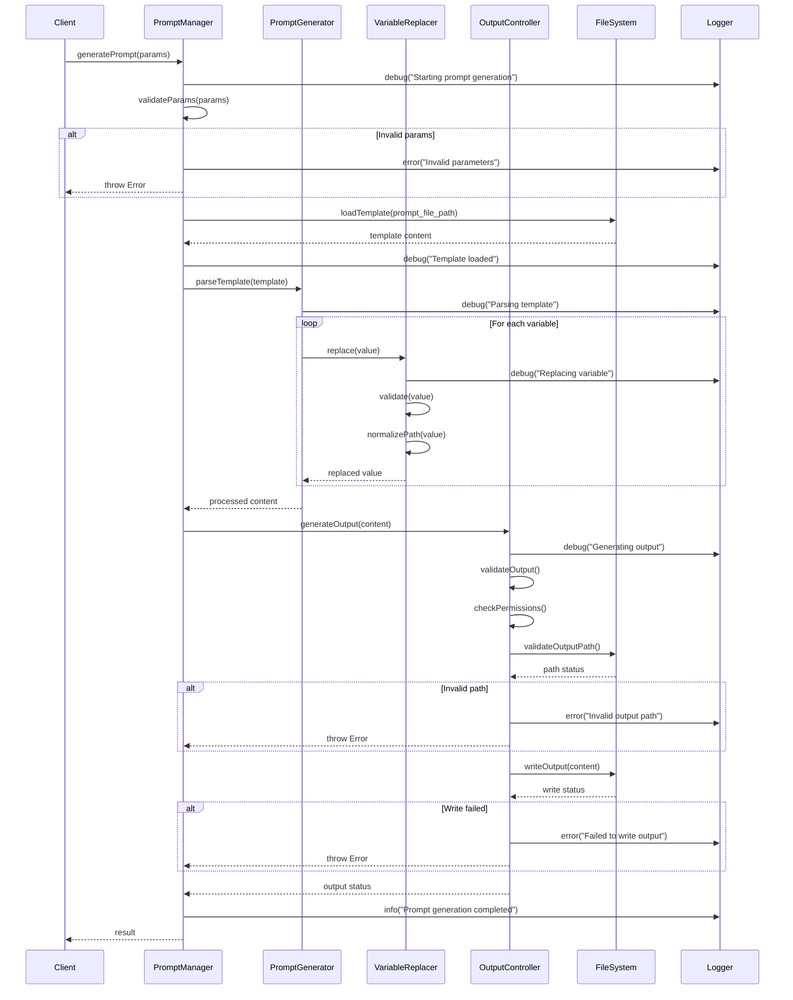

```mermaid
sequenceDiagram
    participant Client
    participant PromptManager
    participant PromptGenerator
    participant VariableReplacer
    participant OutputController
    participant FileSystem
    participant Logger

    Client->>PromptManager: generatePrompt(params)
    PromptManager->>Logger: debug("Starting prompt generation")
    PromptManager->>PromptManager: validateParams(params)
    
    alt Invalid params
        PromptManager->>Logger: error("Invalid parameters")
        PromptManager-->>Client: throw Error
    end
    
    PromptManager->>FileSystem: loadTemplate(prompt_file_path)
    FileSystem-->>PromptManager: template content
    PromptManager->>Logger: debug("Template loaded")
    
    PromptManager->>PromptGenerator: parseTemplate(template)
    PromptGenerator->>Logger: debug("Parsing template")
    
    loop For each variable
        PromptGenerator->>VariableReplacer: replace(value)
        VariableReplacer->>Logger: debug("Replacing variable")
        VariableReplacer->>VariableReplacer: validate(value)
        VariableReplacer->>VariableReplacer: normalizePath(value)
        VariableReplacer-->>PromptGenerator: replaced value
    end
    
    PromptGenerator-->>PromptManager: processed content
    PromptManager->>OutputController: generateOutput(content)
    
    OutputController->>Logger: debug("Generating output")
    OutputController->>OutputController: validateOutput()
    OutputController->>OutputController: checkPermissions()
    
    OutputController->>FileSystem: validateOutputPath()
    FileSystem-->>OutputController: path status
    
    alt Invalid path
        OutputController->>Logger: error("Invalid output path")
        OutputController-->>PromptManager: throw Error
    end
    
    OutputController->>FileSystem: writeOutput(content)
    FileSystem-->>OutputController: write status
    
    alt Write failed
        OutputController->>Logger: error("Failed to write output")
        OutputController-->>PromptManager: throw Error
    end
    
    OutputController-->>PromptManager: output status
    PromptManager->>Logger: info("Prompt generation completed")
    PromptManager-->>Client: result
```
