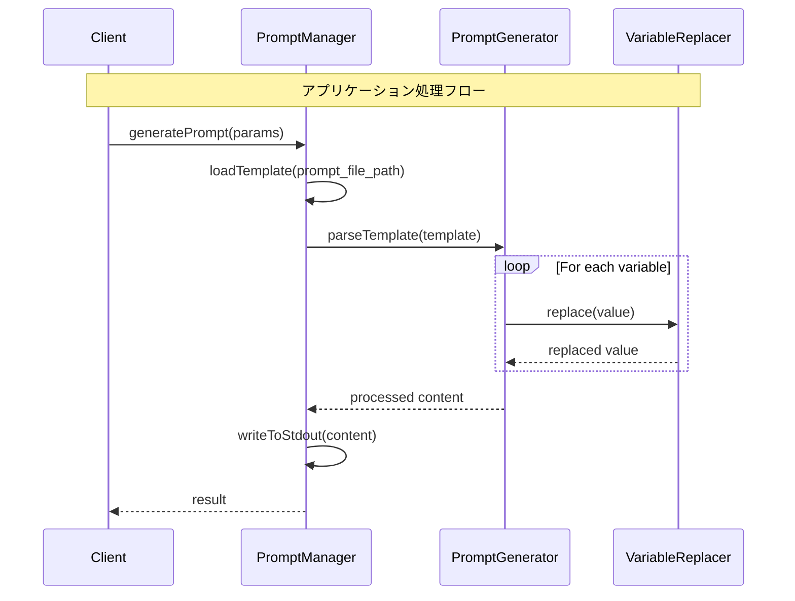

```mermaid
sequenceDiagram
    participant Client
    participant PromptManager
    participant PromptGenerator
    participant VariableReplacer

    Note over Client,VariableReplacer: アプリケーション処理フロー
    Client->>PromptManager: generatePrompt(params)
    PromptManager->>PromptManager: loadTemplate(prompt_file_path)
    PromptManager->>PromptGenerator: parseTemplate(template)
    
    loop For each variable
        PromptGenerator->>VariableReplacer: replace(value)
        VariableReplacer-->>PromptGenerator: replaced value
    end
    
    PromptGenerator-->>PromptManager: processed content
    PromptManager->>PromptManager: writeToStdout(content)
    PromptManager-->>Client: result
```
