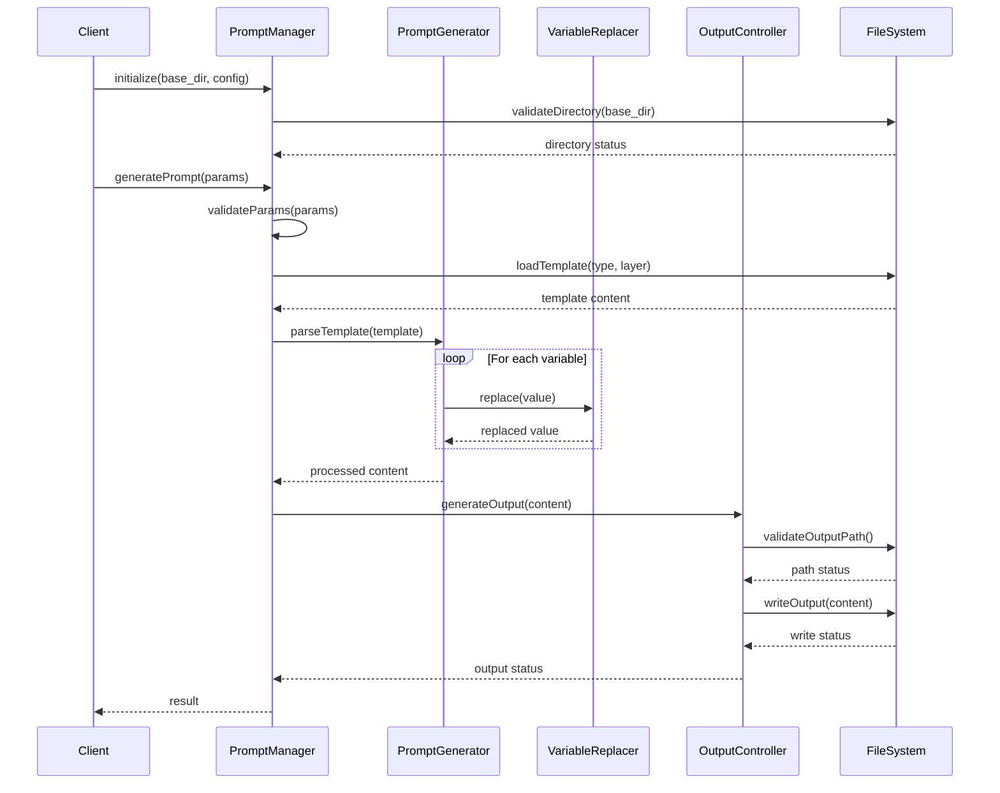

```mermaid
sequenceDiagram
    participant Client
    participant PromptManager
    participant PromptGenerator
    participant VariableReplacer
    participant OutputController
    participant FileSystem

    Client->>PromptManager: initialize(base_dir, config)
    PromptManager->>FileSystem: validateDirectory(base_dir)
    FileSystem-->>PromptManager: directory status

    Client->>PromptManager: generatePrompt(params)
    PromptManager->>PromptManager: validateParams(params)
    PromptManager->>FileSystem: loadTemplate(type, layer)
    FileSystem-->>PromptManager: template content
    PromptManager->>PromptGenerator: parseTemplate(template)
    
    loop For each variable
        PromptGenerator->>VariableReplacer: replace(value)
        VariableReplacer-->>PromptGenerator: replaced value
    end
    
    PromptGenerator-->>PromptManager: processed content
    PromptManager->>OutputController: generateOutput(content)
    OutputController->>FileSystem: validateOutputPath()
    FileSystem-->>OutputController: path status
    OutputController->>FileSystem: writeOutput(content)
    FileSystem-->>OutputController: write status
    OutputController-->>PromptManager: output status
    PromptManager-->>Client: result
``` 