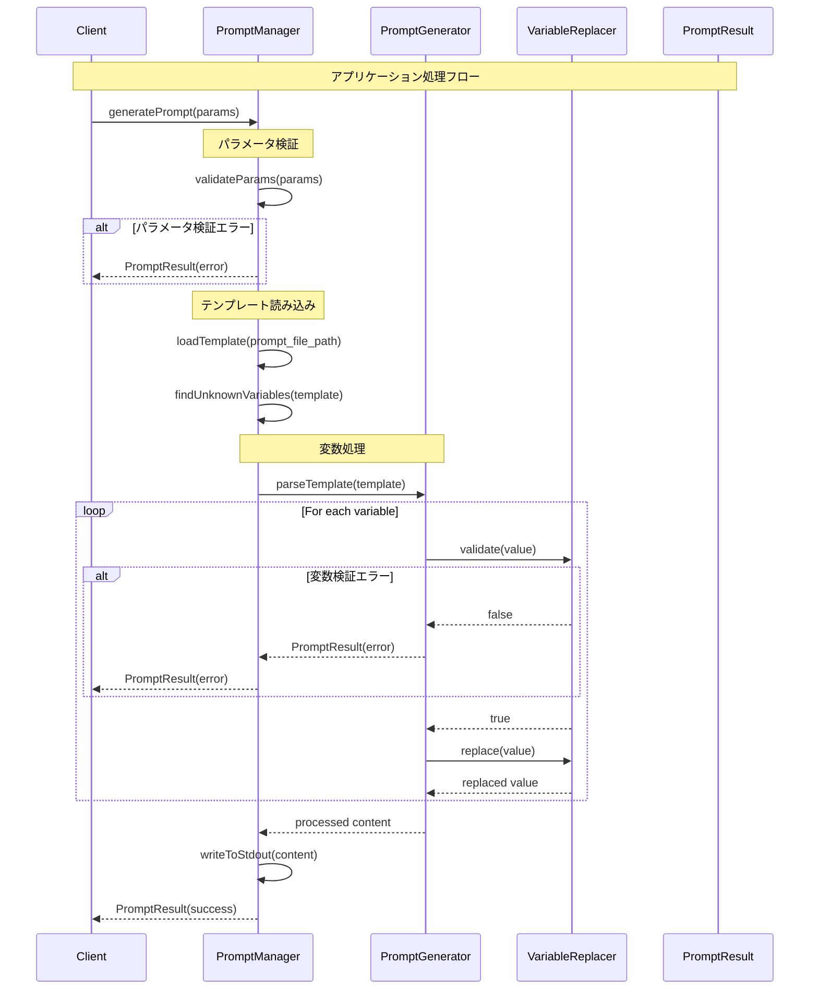

```mermaid
sequenceDiagram
    participant Client
    participant PromptManager
    participant PromptGenerator
    participant VariableReplacer
    participant PromptResult

    Note over Client,PromptResult: アプリケーション処理フロー
    Client->>PromptManager: generatePrompt(params)
    Note over PromptManager: パラメータ検証
    PromptManager->>PromptManager: validateParams(params)
    alt パラメータ検証エラー
        PromptManager-->>Client: PromptResult(error)
    end
    Note over PromptManager: テンプレート読み込み
    PromptManager->>PromptManager: loadTemplate(prompt_file_path)
    PromptManager->>PromptManager: findUnknownVariables(template)
    Note over PromptManager,PromptGenerator: 変数処理
    PromptManager->>PromptGenerator: parseTemplate(template)
    loop For each variable
        PromptGenerator->>VariableReplacer: validate(value)
        alt 変数検証エラー
            VariableReplacer-->>PromptGenerator: false
            PromptGenerator-->>PromptManager: PromptResult(error)
            PromptManager-->>Client: PromptResult(error)
        end
        VariableReplacer-->>PromptGenerator: true
        PromptGenerator->>VariableReplacer: replace(value)
        VariableReplacer-->>PromptGenerator: replaced value
    end
    PromptGenerator-->>PromptManager: processed content
    PromptManager->>PromptManager: writeToStdout(content)
    PromptManager-->>Client: PromptResult(success)
```
