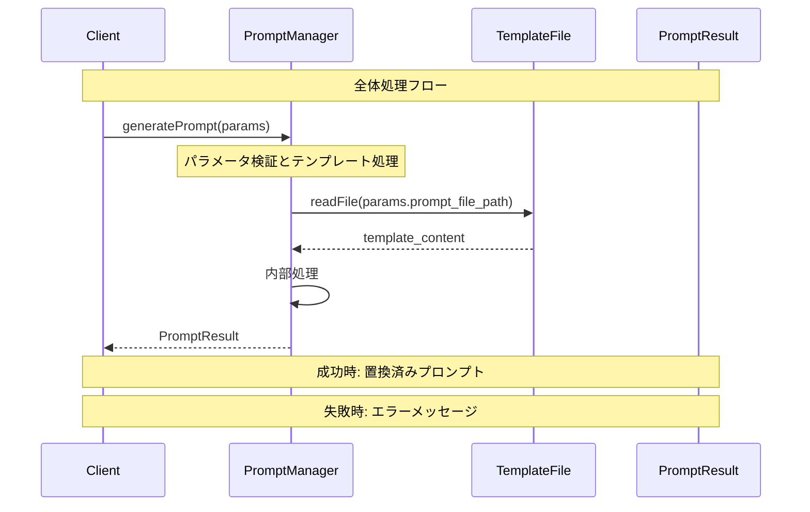

# 全体処理フロー

このシーケンス図は、プロンプト生成処理の全体像を示しています。クライアントからのパラメータを受け取り、内部でパラメータ検証とテンプレート処理を行い、最終的に置換済みのプロンプトまたはエラーメッセージを返却します。処理の成功/失敗に関わらず、常に結果を返却する点が特徴です。

```mermaid
sequenceDiagram
    participant Client
    participant PromptManager
    participant TemplateFile
    participant PromptResult

    Note over Client,PromptResult: 全体処理フロー
    Client->>PromptManager: generatePrompt(params)
    Note over PromptManager: パラメータ検証とテンプレート処理
    PromptManager->>TemplateFile: readFile(params.prompt_file_path)
    TemplateFile-->>PromptManager: template_content
    PromptManager->>PromptManager: 内部処理
    PromptManager-->>Client: PromptResult
    Note over Client,PromptResult: 成功時: 置換済みプロンプト
    Note over Client,PromptResult: 失敗時: エラーメッセージ
``` 