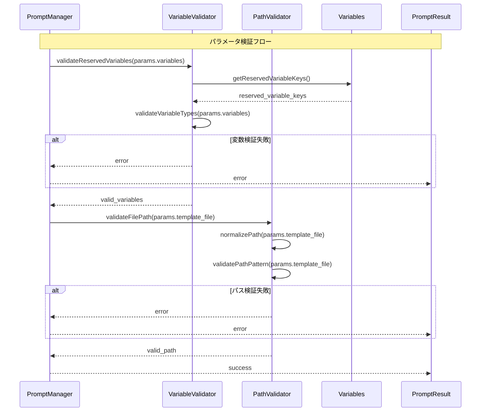

# パラメータ検証

このシーケンス図は、パラメータ検証の詳細なフローを示しています。予約変数の検証とパス検証を独立したステップとして実装し、各ステップでエラーが発生した場合は即座に処理を中断し、エラーを返却します。検証の独立性を保ちながら、必要な情報を順次取得する点が特徴です。

```mermaid
sequenceDiagram
    participant PromptManager
    participant VariableValidator
    participant PathValidator
    participant Variables
    participant PromptResult

    Note over PromptManager,PromptResult: パラメータ検証フロー
    PromptManager->>VariableValidator: validateReservedVariables(params.variables)
    VariableValidator->>Variables: getReservedVariableKeys()
    Variables-->>VariableValidator: reserved_variable_keys
    VariableValidator->>VariableValidator: validateVariableTypes(params.variables)
    alt 変数検証失敗
        VariableValidator-->>PromptManager: error
        PromptManager-->>PromptResult: error
    end
    VariableValidator-->>PromptManager: valid_variables

    PromptManager->>PathValidator: validateFilePath(params.template_file)
    PathValidator->>PathValidator: normalizePath(params.template_file)
    PathValidator->>PathValidator: validatePathPattern(params.template_file)
    alt パス検証失敗
        PathValidator-->>PromptManager: error
        PromptManager-->>PromptResult: error
    end
    PathValidator-->>PromptManager: valid_path

    PromptManager-->>PromptResult: success
``` 