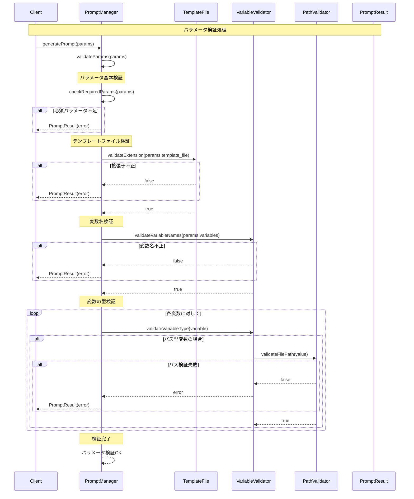

# パラメータ検証処理

このシーケンス図は、パラメータの検証プロセスを詳細に示しています。必須パラメータの存在確認、変数名の形式チェック、パスの妥当性検証を順次行い、いずれかの検証で失敗した場合は即座にエラーを返却します。各検証は独立しており、前の検証が成功した場合のみ次の検証に進みます。

```mermaid
sequenceDiagram
    participant Client
    participant PromptManager
    participant TemplateFile
    participant VariableValidator
    participant PathValidator
    participant PromptResult

    Note over Client,PromptResult: パラメータ検証処理
    Client->>PromptManager: generatePrompt(params)
    PromptManager->>PromptManager: validateParams(params)
    
    Note over PromptManager: パラメータ基本検証
    PromptManager->>PromptManager: checkRequiredParams(params)
    alt 必須パラメータ不足
        PromptManager-->>Client: PromptResult(error)
    end

    Note over PromptManager: テンプレートファイル検証
    PromptManager->>TemplateFile: validateExtension(params.template_file)
    alt 拡張子不正
        TemplateFile-->>PromptManager: false
        PromptManager-->>Client: PromptResult(error)
    end
    TemplateFile-->>PromptManager: true

    Note over PromptManager: 変数名検証
    PromptManager->>VariableValidator: validateVariableNames(params.variables)
    alt 変数名不正
        VariableValidator-->>PromptManager: false
        PromptManager-->>Client: PromptResult(error)
    end
    VariableValidator-->>PromptManager: true

    Note over PromptManager: 変数の型検証
    loop 各変数に対して
        PromptManager->>VariableValidator: validateVariableType(variable)
        alt パス型変数の場合
            VariableValidator->>PathValidator: validateFilePath(value)
            alt パス検証失敗
                PathValidator-->>VariableValidator: false
                VariableValidator-->>PromptManager: error
                PromptManager-->>Client: PromptResult(error)
            end
            PathValidator-->>VariableValidator: true
        end
    end

    Note over PromptManager: 検証完了
    PromptManager-->>PromptManager: パラメータ検証OK
``` 