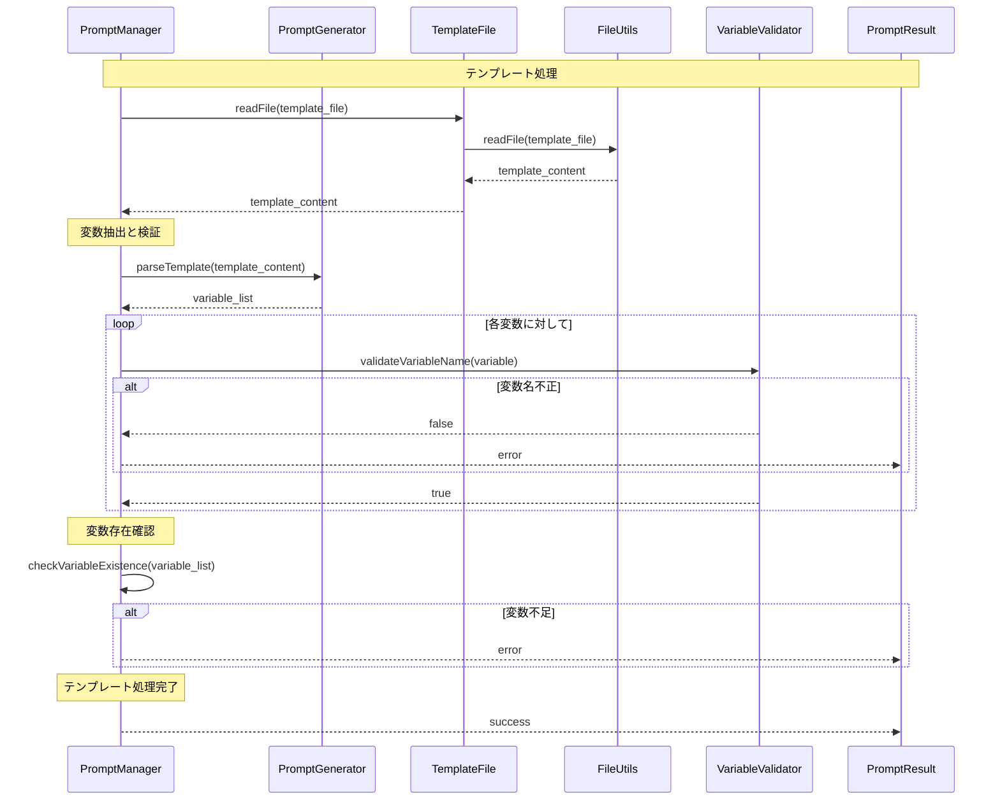

# テンプレート処理

このシーケンス図は、テンプレートファイルの処理フローを示しています。ファイルの読み込みから始まり、テンプレート内の変数抽出、変数の存在確認までを順次行います。各ステップでエラーが発生した場合は即座に処理を中断し、エラーを返却します。テンプレートの内容を解析せず、変数の置換のみを行う点が特徴です。

```mermaid
sequenceDiagram
    participant PromptManager
    participant PromptGenerator
    participant TemplateFile
    participant FileUtils
    participant VariableValidator
    participant PromptResult

    Note over PromptManager,PromptResult: テンプレート処理
    PromptManager->>TemplateFile: readFile(template_file)
    TemplateFile->>FileUtils: readFile(template_file)
    FileUtils-->>TemplateFile: template_content
    TemplateFile-->>PromptManager: template_content

    Note over PromptManager: 変数抽出と検証
    PromptManager->>PromptGenerator: parseTemplate(template_content)
    PromptGenerator-->>PromptManager: variable_list

    loop 各変数に対して
        PromptManager->>VariableValidator: validateVariableName(variable)
        alt 変数名不正
            VariableValidator-->>PromptManager: false
            PromptManager-->>PromptResult: error
        end
        VariableValidator-->>PromptManager: true
    end

    Note over PromptManager: 変数存在確認
    PromptManager->>PromptManager: checkVariableExistence(variable_list)
    alt 変数不足
        PromptManager-->>PromptResult: error
    end

    Note over PromptManager: テンプレート処理完了
    PromptManager-->>PromptResult: success
``` 