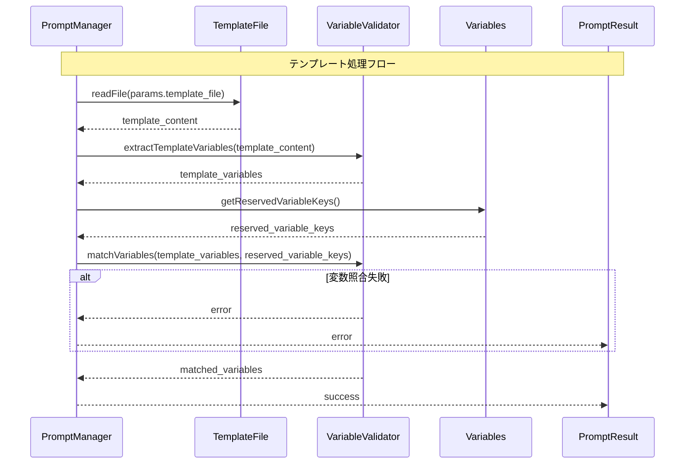

# テンプレート処理

このシーケンス図は、テンプレート処理の詳細なフローを示しています。テンプレートファイルの読み込み、テンプレート変数の抽出、予約変数との照合を順次行い、各ステップでエラーが発生した場合は即座に処理を中断し、エラーを返却します。変数の検証と照合の責務を明確に分離している点が特徴です。

```mermaid
sequenceDiagram
    participant PromptManager
    participant TemplateFile
    participant VariableValidator
    participant Variables
    participant PromptResult

    Note over PromptManager,PromptResult: テンプレート処理フロー
    PromptManager->>TemplateFile: readFile(params.template_file)
    TemplateFile-->>PromptManager: template_content

    PromptManager->>VariableValidator: extractTemplateVariables(template_content)
    VariableValidator-->>PromptManager: template_variables

    PromptManager->>Variables: getReservedVariableKeys()
    Variables-->>PromptManager: reserved_variable_keys

    PromptManager->>VariableValidator: matchVariables(template_variables, reserved_variable_keys)
    alt 変数照合失敗
        VariableValidator-->>PromptManager: error
        PromptManager-->>PromptResult: error
    end
    VariableValidator-->>PromptManager: matched_variables

    PromptManager-->>PromptResult: success
``` 