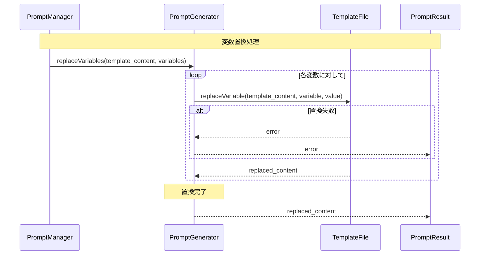

# 変数置換処理

このシーケンス図は、テンプレート内の変数を実際の値で置換する処理フローを示しています。検証済みの変数と値を使用して、テンプレート内の変数を順次置換していきます。エラーが発生した場合は即座に処理を中断し、エラーメッセージを返却します。

```mermaid
sequenceDiagram
    participant PromptManager
    participant PromptGenerator
    participant TemplateFile
    participant PromptResult

    Note over PromptManager,PromptResult: 変数置換処理
    PromptManager->>PromptGenerator: replaceVariables(template_content, variables)

    loop 各変数に対して
        PromptGenerator->>TemplateFile: replaceVariable(template_content, variable, value)
        alt 置換失敗
            TemplateFile-->>PromptGenerator: error
            PromptGenerator-->>PromptResult: error
        end
        TemplateFile-->>PromptGenerator: replaced_content
    end

    Note over PromptGenerator: 置換完了
    PromptGenerator-->>PromptResult: replaced_content
``` 