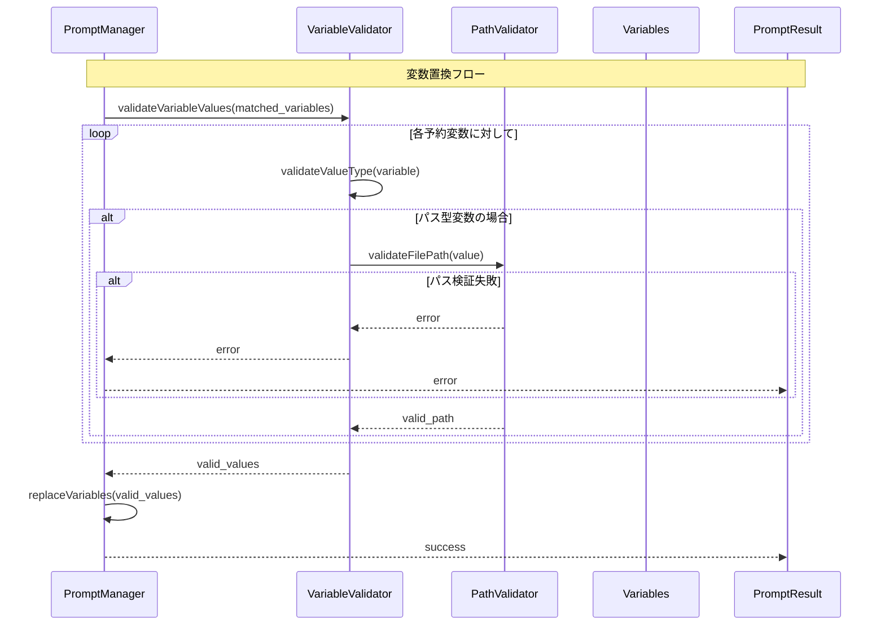

# 変数置換処理

このシーケンス図は、変数置換処理の詳細なフローを示しています。予約変数の値検証とテンプレート内の変数置換を順次行い、各ステップでエラーが発生した場合は即座に処理を中断し、エラーを返却します。変数の検証と置換の責務を明確に分離している点が特徴です。

```mermaid
sequenceDiagram
    participant PromptManager
    participant VariableValidator
    participant PathValidator
    participant Variables
    participant PromptResult

    Note over PromptManager,PromptResult: 変数置換フロー
    PromptManager->>VariableValidator: validateVariableValues(matched_variables)
    loop 各予約変数に対して
        VariableValidator->>VariableValidator: validateValueType(variable)
        alt パス型変数の場合
            VariableValidator->>PathValidator: validateFilePath(value)
            alt パス検証失敗
                PathValidator-->>VariableValidator: error
                VariableValidator-->>PromptManager: error
                PromptManager-->>PromptResult: error
            end
            PathValidator-->>VariableValidator: valid_path
        end
    end
    VariableValidator-->>PromptManager: valid_values

    PromptManager->>PromptManager: replaceVariables(valid_values)
    PromptManager-->>PromptResult: success
``` 